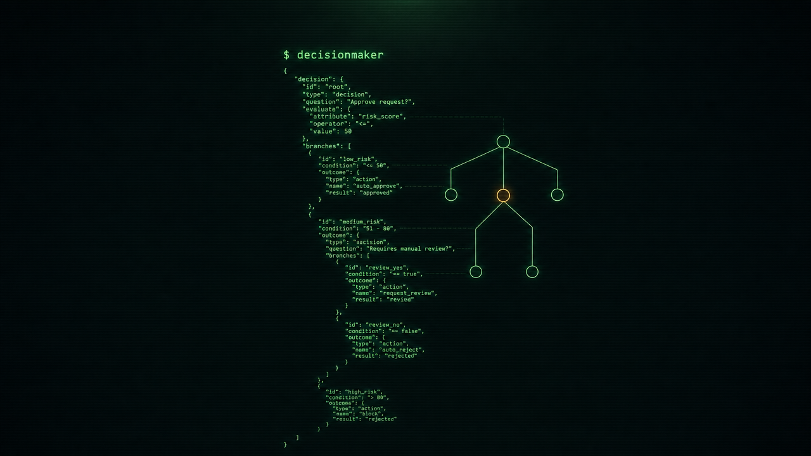

# Decision-Maker

<p align="center">
  
</p>

A local, containerized decision engine. You give it a **state** (text or structured
data) plus a set of **typed questions**, and it returns a **calibrated probability
distribution** over each question's answers — all in a single forward pass, no
token decoding.

It is an *engine and wire contract with thin typed clients*, not a chat model.
The product is the trained decision head (ECE-calibrated on its own seed data),
the `{state, questions} → per-candidate probabilities` contract, and the SDKs.

---

## Why it exists

Most "ask an LLM a yes/no question" setups generate free text and then try to
parse it. That is slow and un-calibrated. Decision-Maker instead treats each
question as a **candidate-leaf scoring problem**:

- Every candidate path (N states × M questions × K candidates) is packed into
  one batch and passed through a single frozen backbone forward.
- A small **trained decision head** reads the backbone's hidden state at each
  leaf's last token and emits a scalar per candidate.
- Softmax over a question's candidate scalars gives the distribution.

No next-token decoding anywhere — `output_tokens` is always `0`. The distributions
are calibrated by construction: the head is fine-tuned on a proper-scoring
objective (CE / Brier / paired) and ECE-gated on test + OOD splits.

The three question types map directly to three answer shapes:

| Type    | Input                                   | Output (answer)                              |
|---------|-----------------------------------------|----------------------------------------------|
| boolean | yes/no question, optional `{true,false}` criteria | `round(p_true, 6)` — a single probability, **no** confidence field |
| choice  | 2..255 option-key → description, order preserved | winning key, per-option probabilities (sum to 1), confidence |
| score   | 2..10 ordered level descriptions, low→high | fractional score Σ i·pᵢ, per-level probabilities, legend, confidence |

`confidence` is how *peaked* the returned distribution is on its winner (spread),
used as a gate — it is explicitly **not** "probability this is correct."

---

## Quickstart

### 1. Build the image (one-time; ~2–3 GB, several minutes)

```bash
cd ~/workspace/decisionmaker
podman build -f deploy/Containerfile.serve -t decisionmaker-serve:local .
```

### 2. Install + start the service (quadlet; autostarts on reboot)

```bash
mkdir -p ~/.config/containers/systemd
cp deploy/decisionmaker.network deploy/decisionmaker-serve.container \
     deploy/healthcheck.sh ~/.config/containers/systemd/
chmod +x ~/.config/containers/systemd/healthcheck.sh
systemctl --user daemon-reload
systemctl --user start decisionmaker-serve
```

First start downloads the pinned model once and loads it; later starts are
load-once and warm. Default endpoint: `http://127.0.0.1:8090`.

### 3. Check readiness and evaluate

```bash
curl -s http://127.0.0.1:8090/health
curl -s -X POST http://127.0.0.1:8090/v1/decisionmaker \
  -H 'Content-Type: application/json' -d @tests/fixtures/domain_shape.request.json \
  | python3 -m json.tool
```

`/health` returns `200` only when the model is loaded and warm.

There is also a convenience target (builds image, restarts, polls health):

```bash
make serve-up
```

---

## A worked request

```jsonc
{
  "state": "Customer wrote: 'Our invoice is overdue and we will cancel.'",
  "questions": {
    "urgency": { "type": "boolean", "instructions": "Does this convey urgency?" },
    "routing": {
      "type": "choice",
      "instructions": "Which team should handle this?",
      "criteria": { "billing": "Payments, invoicing, refunds",
                    "technical": "Bugs, outages, integrations",
                    "sales": "Pricing, upgrades, new accounts" }
    }
  }
}
```

```jsonc
{
  "model": "Qwen/Qwen3-0.6B",
  "answers": {
    "urgency":  { "type": "boolean", "boolean": 0.92 },
    "routing":  { "type": "choice", "choice": "billing",
                  "probabilities": { "billing": 0.85, "technical": 0.08, "sales": 0.07 },
                  "confidence": 0.82 }
  },
  "usage": { "input_tokens": 312, "output_tokens": 0 }
}
```

Answers come back under the same qids you sent. The qid is never part of
inference (qid-invariance).

---

## Documentation

The `docs/` directory is the deep reference:

- [API.md](docs/API.md) — HTTP contract, question/answer shapes, error model.
- [architecture.md](docs/architecture.md) — engine design, one-forward leaf-scorer,
  calibration theory, container/GPU wiring.
- [data.md](docs/DATA.md) — JSONL row schema, the seed generator, split hygiene.
- [calibration.md](docs/CALIBRATION.md) — real ECE/Brier results on the seed set.
- [deploy.md](docs/DEPLOY.md) — Podman Quadlet install, GPU pinning, ops, troubleshooting.
- [GOLD_COMPILER.md](docs/GOLD_COMPILER.md) — the Gold Compiler: raw prose → verified
  → exact-gold training data (plans 05 + 06), no teacher LLM.
- [AGENTS.md](docs/AGENTS.md) — verified state of every phase, written for a
  fresh developer.

The OpenAPI spec at [`spec/openapi.yaml`](spec/openapi.yaml) is the machine-readable
source of truth for the wire contract.

---

## SDKs

Thin typed clients for the contract, in two languages, verified for parity:

| SDK | Location | Notes |
|-----|----------|-------|
| Go  | `sdk/go/` | `Client.Evaluate`, typed `APIError` with `errors.Is`, `Answer.Decide` gate |
| Rust| `sdk/rust/` | typed tagged-enum answers, async (default) + `blocking` feature |

Both implement a **wire invariant**: structured request keys are sent in
APLPHABETICALLY SORTED order (Go/Rust std map encoders). A raw curl sends the
bytes as written, so cross-language parity tests canonicalize fixtures to the
sorted-key form first. Don't add a fixture with unsorted structured keys and
expect curl == SDK byte-for-byte.

Minimal Go example:

```go
client := decisionmaker.NewClient("http://127.0.0.1:8090", 0)
resp, err := client.Evaluate(ctx, &decisionmaker.Request{
    State: "Customer wrote ...",
    Questions: map[string]*decisionmaker.Question{
        "routing": decisionmaker.ChoiceQuestion("Which team?",
            map[string]any{"billing": "Payments", "technical": "Bugs"}),
    },
})
```

---

## The model & training

- **Backbone**: `Qwen/Qwen3-0.6B` at revision `c1899de289a04d12100db370d81485cdf75e47ca`.
  Loaded `fp32` parameter storage, bf16-autocast forward, `attn_implementation="sdpa"`,
  `use_cache=False` (no decoding).
- **Head**: `LayerNorm(hidden) → Linear(hidden, 1)` → scalar per candidate. Freshly
  initialized (not the base checkpoint's), fine-tuned head-only with the backbone frozen.
- **Objective**: CE (primary) and Brier (strongest on the seed run), plus an
  RLCD-style paired proper-reward arm (the experiment).
- **Gate**: boolean ECE over 10 fixed bins on test AND OOD splits, threshold 0.20.
  All three arms pass on the 2026-09-18 run; see `docs/calibration.md`.

Reproduce a training run:

```bash
python train/train.py --data data/seed.jsonl --run-dir runs/seed_ce \
  --loss ce --epochs 3 --gpu=<uuid>
```

(fixed as a quadlet at `deploy/decisionmaker-train.container`). The ECE gate
decides the exit code: `0` pass, `2` fail.

---

## The Gold Compiler (raw prose → exact-gold training data)

The engine is only as honest as the gold you train it on, and real gold is
expensive. `scripts/gold_compiler.py` compiles a decision-dense document (a
SKILL.md, a policy, a runbook) into calibrated training rows **without a teacher
LLM as the source of truth** — extract → verify → synthesize → probe:

- **extract** reads prose and emits *candidate* rules (recall-first, never trusted);
- **verify** is the anti-hallucination wall — every rule's fields resolve in the
  schema, every outcome is a real criteria member, and a deterministic rule
  interpreter checks each rule against hand-marked anchor states (no model
  judges; the only human step is marking a few trigger states per rule);
- **synthesize** enumerates the state space, runs the interpreter, and *computes*
  the soft gold — byte-deterministic double-runs (`data_sha256`);
- **probe** runs the skill's own commands read-only as a referee, flagging any
  rule whose prediction disagrees with the measured world.

`scripts/history_to_gold.py` is the plan-06 example gold-loader: empirical
outcome gold measured from a historical log (pluggable source — swap the loader,
keep the harness). Full details and honest limits in `docs/GOLD_COMPILER.md`.

```bash
make gold-compiler           # lint + verify-corpus (all tables verified) + determinism
scripts/gold_compiler.py --input corpus --out research/data/gold_compiler
```

---

## GPU assignment

GPUs are assigned by **UUID** in [`deploy/gpu.env`](deploy/gpu.env) (the single
source of truth) — not by device minor. `/dev/nvidiaN` minors flip across reboots,
and the runtime must see the right card *before* torch imports (which caches the
visible devices). Current split:

- Serve → RTX 4070 Ti
- Train → RTX 5090

Re-verify live before any GPU work:

```bash
scripts/verify_gpu.sh
```

---

## Development

The dev venv is `.venv` (managed by `uv`; see `pyproject.toml`). Run everything
from `make`:

```bash
make test            # full gate: unit + contract + parity + Go + Rust
make unit            # pytest + spec validation
make contract        # spec gate + fixtures
make parity          # cross-language golden parity (needs server up)
make go              # go test (sdk/go)
make rust            # cargo test (sdk/rust)
make lint            # gofmt + go vet + cargo fmt + clippy
make bench           # latency/throughput benchmark (needs server up)
make serve-up       # build image, restart quadlet, poll health
make serve-down     # stop it
make serve-restart   # restart it
make seed            # regenerate synthetic seed data
make verify-seed     # oracle ECE baseline on the seed
make gold-compiler   # gold compiler gates: lint + verify-corpus + determinism
```

Repo layout:

```
server/src/          engine (pure, torch-free core) + torch head + FastAPI app
spec/openapi.yaml    wire contract (source of truth)
sdk/go, sdk/rust     typed clients + parity CLI examples
train/               seed generator, loss arms, ECE harness, training entrypoint
scripts/             spec validator, GPU verifier, benchmark, parity harness,
                     gold compiler CLI + CI + history gold-loader
research/compiler/   gold compiler: corpus tables, anchors, core engine, renderers
research/data/       committed research outputs incl. gold_compiler/ train rows
deploy/              Containerfile, quadlets (serve + train), gpu.env, network
tests/               engine tests + request/response fixtures
docs/                the deep reference
tests/               pytest suite (engine, service, model, calibration)
```

---

## License

MIT. See [LICENSE](LICENSE).